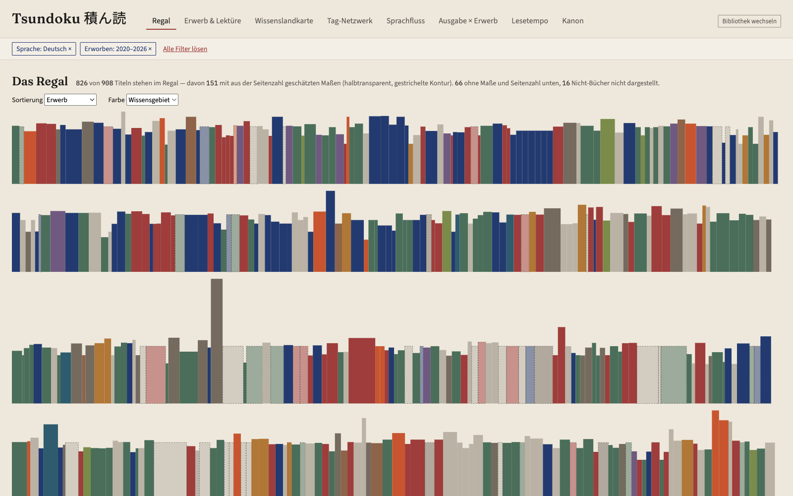
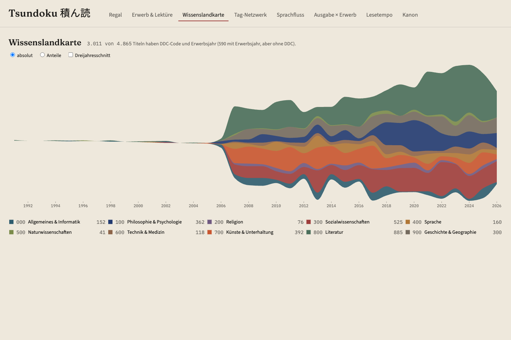
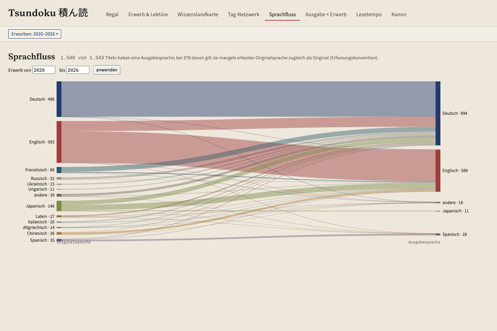

# Tsundoku 積ん読

Interaktive Exploration einer LibraryThing-Bibliothek: 4.865 Einträge,
Erwerbshistorie ab 1991, Lesehistorie ab 1988.

積ん読 — „Bücher kaufen und stapeln, ohne sie zu lesen". Der Name ist Programm:
Die zentrale Frage der Anwendung ist nicht „was besitze ich", sondern **„was
verrät die Differenz zwischen Erwerb und Lektüre über mich"**. Nur gut ein
Viertel der Sammlung ist gelesen; der Rest ist der Stapel, und der Stapel hat
eine Geschichte.

Clientseitige Single-Page-App, kein Backend. Der Export wird einmalig
normalisiert und als statisches JSON ausgeliefert.

## Was es zu sehen gibt

Acht Ansichten, und jede ist zugleich Anzeige und Filtereingabe: Ein Klick auf
einen Tag im Netzwerk, ein Jahr in der Zeitleiste oder einen Strom im
Sprachfluss schränkt den Datensatz für *alle* anderen Ansichten ein. Die
aktiven Filter stehen als Chips über jeder Ansicht, einzeln lösbar, und der
komplette Zustand liegt in der URL — jede Sicht auf die Sammlung ist ein Link.

**Das Regal** ist Start- und Signature-Ansicht: jeder Buchrücken ein Rechteck
in echten Proportionen, Höhe und Dicke aus den Katalogmaßen (wo sie fehlen,
aus der Seitenzahl geschätzt und sichtbar gestrichelt markiert). Farbe nach
Wissensgebiet, Sprache, Lesestatus oder Erwerbsjahr; Sortierung nach Erwerb,
Autor·in, Höhe oder Wissensgebiet. Hier mit den Filtern „Sprache: Deutsch"
und „Erworben: 2020–2026":



**Die Wissenslandkarte** zeichnet die Interessengebiete über 35 Erwerbsjahre
als Streamgraph der Dewey-Hauptklassen — vom schmalen Rinnsal der frühen Jahre
über die Massenkatalogisierung 2006 bis zum breiten Strom aus Literatur (grün),
Sozialwissenschaften (rot) und Künsten:



**Der Sprachfluss** verbindet Originalsprache und Ausgabesprache als
Sankey-Diagramm: Was wird im Original gelesen, was in Übersetzung? Hier
eingeschränkt auf die Erwerbsjahre 2020–2026 — gut sichtbar der japanische
Strom, der sich in deutsche und englische Übersetzungen und ins Original
aufteilt:



Dazu kommen: **Erwerb & Lektüre** (gegenläufige Zeitreihen, dazwischen wächst
der Stapel), das **Tag-Netzwerk** (welche Themen hängen zusammen, welche Bücher
schlagen Brücken), **Ausgabe × Erwerb** (Neuerscheinungen auf der Diagonale,
Rückgriffe darunter), das **Lesetempo** (Seiten gegen Tage, facettierbar nach
Sprache — wird im Original langsamer gelesen?) und der **Kanonabgleich**
(Harenberg, „1001 Books" & Co.: besessen vs. gelesen, grundsätzlich ohne
Prozentangaben, denn der Listenumfang ist unbekannt).

Fehlende Daten werden dabei nie versteckt: Jede Ansicht nennt die Abdeckung
ihrer eigenen Datengrundlage, und alles, was die Normalisierung korrigiert,
schätzt oder verwirft, ist als Regel dokumentiert und gezählt
(`docs/datenprofil.md`).

## Start

**Ohne Installation:** Die App läuft als statische Seite auf
<https://saigyo.github.io/tsundoku/> — ohne eingebaute Bibliotheksdaten.
Beim Start nimmt sie einen LibraryThing-Export entgegen, normalisiert ihn
direkt im Browser (derselbe Code wie das CLI-Skript), zeigt die Kennzahlen
der Normalisierung und lädt dann die Ansichten. Die Datei verlässt den
Browser dabei nicht; die normalisierten Daten bleiben lokal im Browser
(IndexedDB) und überstehen einen Reload — „Bibliothek wechseln" lädt
jederzeit einen anderen Export. Obergrenze sind 10.000 Einträge, denn die
Ansichten halten alles im Speicher; größere Bibliotheken lassen sich bei
LibraryThing gefiltert exportieren.

**Lokal:** Als Datengrundlage dient ein Export der eigenen
LibraryThing-Bibliothek: auf <https://www.librarything.com/export.php> das
Format **JSON** wählen, die erzeugte Datei herunterladen und dem Normalizer
übergeben:

```bash
node scripts/normalize.mjs ~/pfad/librarything_export.json
npm install
npm run dev
```

Der erste Befehl schreibt `public/data/library.json` und gibt Kennzahlen aus,
die gegen `docs/datenprofil.md` geprüft werden können. Fehlt die Datei,
zeigt auch die lokale App den Upload-Dialog. (Die dort dokumentierten
Zahlen und einige Bereinigungsregeln sind spezifisch für diese Bibliothek —
mit einem fremden Export läuft die App trotzdem, nur das Datenprofil passt
dann nicht mehr.)

## Stack

Vite + React + TypeScript, Zustand für den einen Filter-Store, D3-Module
(`d3-scale`, `d3-shape`, `d3-force`, `d3-sankey`) für Skalen, Layouts und
Pfade — das SVG rendert React selbst. Kein Router: der Query-String ist der
Zustand. Der Normalizer ist ein Node-freies ES-Modul
(`scripts/normalize-core.mjs`), das CLI und Browser-Upload gemeinsam nutzen.
Vitest testet Normalizer, Filterlogik und URL-Roundtrip; eine GitHub Action
baut und testet jeden PR, eine weitere veröffentlicht `main` als
GitHub-Page (ohne Bibliotheksdaten).

## Dokumente

- `CLAUDE.md` — Stack, Architektur, Konventionen, Gestaltungsrichtung
- `docs/datenprofil.md` — Feldinventar, Bereinigungsregeln, Fallstricke
- `docs/visualisierungen.md` — die acht Ansichten mit Abnahmekriterien

## Stand

Anwendung vollständig: Fundament (Filter-Store, URL-Sync, Shell) und alle acht
Views aus `docs/visualisierungen.md`. Start mit `npm run dev`, statischer Build
mit `npm run build`. Datengrundlage einmalig per
`node scripts/normalize.mjs <export.json>` erzeugen.

## Lizenz

[MIT](LICENSE) — der Code ist frei verwendbar. Die Bibliotheksdaten selbst
(der LibraryThing-Export) sind nicht Teil des Repositories.
